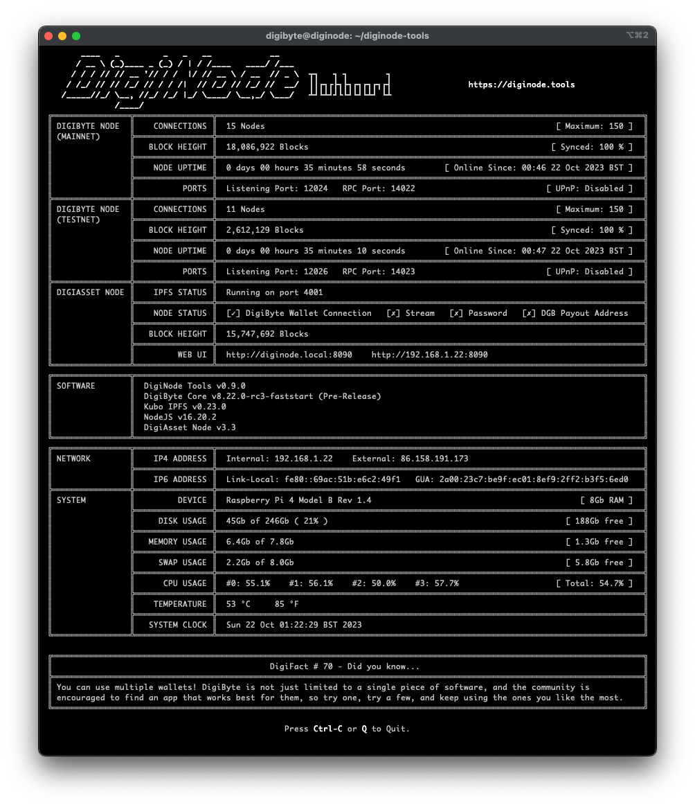

# DigiNode Tools

### What's a DigiNode?
A DigiNode is a device that runs a [DigiByte](https://digibyte.org/) Full Node and [DigiAsset Node](https://ipfs.digiassetx.com/) helping to further decentralize the DigiByte ecosystem. 

### What are DigiNode Tools?
DigiNode Tools are a suite of Linux bash scripts that make it really easy to setup, monitor and manage a DigiNode on a Raspberry Pi 4 or Ubuntu/Debian system.
- **DigiNode Setup** - Helps you to install, upgrade, backup and restore your DigiByte and/or DigAsset Node.
- **DigiNode Dashboard** - Provides a live dashboard to quickly check the status of your DigiNode.

### What do I need to run a DigiNode?

- A **Raspberry Pi 4 8Gb** is the recommended device for running a DigiNode. It offers the most user-friendly setup experience. See [here](/docs/suggested_hardware.md) for the parts you need.
- DigiNode Tools also runs on most Ubuntu or Debian based systems. ARM64 and x86_64 hardware are both supported. A 64-bit OS is required. For more info, see the [Compatibility](#system-compatibility) section below.
- DigiNode is designed to operate headless - i.e. no display, keyboard or mouse is required. Everything can be managed remotely from your main computer. (Note: These may be needed during setup on some Linux systems, but are not needed at all for the Raspberry Pi 4.)

## About DigiNode Setup


DigiNode Setup helps you to setup and manage your DigiNode:

- Intuitively walks you though the process of setting up a DigiByte Node and/or DigiAsset Node. 
   + Designed with less-technical users in mind - almost no linux command line experience required. Setup is entirely menu-driven.
   + Fast! The entire DigiNode Setup takes only a few minutes.
   + Automatically checks your system hardware and OS are compatible, and that there is sufficient disk space and memory.
   + Checks for swap file, and helps create one on low memory devices.
   + Prompts you to run a mainnet or testnet DigiByte Node, or a Dual Node - run both simultaneously on the same system!
   + Creates or updates the digibyte.conf settings file with optimal settings.
   + Creates system services (systemd or upstart) to ensure your DigiByte Node and DigiAsset Node are kept running 24/7, even after a reboot.
   + Automatically configures your DigiAsset Node with your RPC credentials, ensuring your DigiAsset Node can connect to your DigiByte wallet. (No manual configuration required.)
- Quickly and easilly upgrade your DigiByte and DigiAssets Node software to the latest release.
- Optionally, install a pre-release version of DigiByte Core (See [Advanced Features](GETSTARTED.md#advanced-features).) Easilly downgrade DigiByte Core pre-release back to the release version, if needed. 
- Option to create a 'digibyte' user and set system hostname to 'diginode'. 
- Option to enable zeroconf networking (Bonjour) so you can access your node at http://diginode.local:8090 - i.e. no need to remember the IP address.
- Option to install a custom DiigNode MOTD (Message of the Day). This is displayed whenever you connect to your DigiNode via the terminal and reminds you of the commands to run it.
- Unattended Install mode - install can be pre-configured to run without any prompts. Great for batch setups.
- Includes DigiNode Dashboard, a powerful dashboard for monitoring the status of your DigiNode. (More info [below](#about-diginode-dashboard).)

Go [here](GETSTARTED.md) to get started setting up your DigiNode. Once installed, DigiNode Setup can be run from the command line by entering: ```diginode-setup```

## Additional Features


Once DigiNode Tools have been installed, you can access additional features via the DigiNode Setup menu by entering: ```diginode-setup```

- **Update**: Installs any software updates for your DigiNode, and checks that all services are running correctly. It also ensures that the RPC credentials are correct and that the DigiAsset Node is able to connect with the DigiByte Node. Most DigiNode issues can be solved by performing an Update.
- **Backup**: Helps you to backup your DigiByte wallet and/or your DigiAsset Node settings to an external USB stick.
- **Restore**: Helps you to restore your DigiNode from an existing backup.
- **UPnP**: Enable/disable using UPnP to forward required ports. Use of UPnP is generally not reccomeneded as some routers do not support it correctly. For best results, set up port forwarding manually.
- **Chain**: Switch between running DigiByte Core on mainnet or testnet, or a Dual Node.
- **MOTD**: Enable the custom DigiNode Message of the Day. This displays the DigiNode logo and usage instructions whenever you login via the terminal.
- **Extras**: Install additional software such as the cooling fan software for the Argon ONE case for the Rasperry Pi.
- **Reset**: Gives you the ability to selectively reset your DigiNode settings in the event of a problem.
- **Uninstall**: Unistalls DigiNode software from your system. It lets you choose which individual components you wish to remove. Your DigByte wallet will not be harmed.

## About DigiNode Dashboard



DigiNode Dashboard is a powerful dashboard for monitoring the status of your DigiNode:

- Monitor your DigiNode on your local machine via the command line, locally or remotely over SSH.
- Quickly check that your DigiByte and DigiAsset Nodes are running correctly.
- Displays live DigiByte and DigiAsset data including:
    + Connection Count
    + Block Height (with Sync Progress)
    + IP addresses (local and external)
    + Web UI address 
    + Node uptime
    + Disk, RAM and swap usage
- Periodically checks for software updates to your DigiNode (not more than once every 24 hours) and helps you install them.
- Built-in port checker to ensure the correct ports are open on your router.

DigiNode Dashboard can be run from the command line by entering: ```diginode```

*Note: If you already have a DigiByte Node running on your machine, and simply want to use the DigiNode Dashboard with it, DigiNode Setup gives you the option to install DigiNode Tools only (i.e. these scripts). They will be installed to: ~/diginode-tools. You should then be able to use the Dashboard with your existing DigiByte node.*

## System Compatibility

- System Requirements:
    + DigiNode Tools was designed for the Raspberry Pi 4 8Gb running Rasperry Pi OS Lite 64-bit. The Raspberry Pi 5 8Gb is also supported.
    + DigiNode Tools also runs on most Ubuntu or Debian based systems. Debian 10 Buster or later is recommended. Ubuntu Focal 20.04 or later is recommended.  
    + Both ARM64 and x86_64 hardware are supported. A 64-bit OS is required. 
    + DigiNode has been designed with headless operation in mind - no display, keyboard or mouse are required. (Note: These are not needed at all for Raspberry Pi setup, though may be required during setup on other Linux devices.)
- Memory Requirements:
    + At least 8GB RAM is strongly recommended. 
    + With 8Gb RAM or more, you can safely run a DigiByte mainnet node, a DigiByte testnet node and a DigiAsset Node at the same time on the same device.
    + With 4Gb RAM, you should be able to run a single DigiByte Node ONLY (i.e. No DigiAsset Node). However, performance can be sluggish, and it will require a large swap file that puts a lot of strain on the SSD. In short, 4Gb is fine for testing, but definitely not recommended for long term use.
    + Less than 4Gb RAM is not supported.
    + Regardless of how much memory your device has, it is always sensible to have a swap file. DigiNode Setup can help configure this for you.
- Disk Space Requirements:
    + As of January 2024, the DigiByte blockchain currently requires just under 50Gb of disk space. 
    + If you are setting up a DigiNode, at least 128Gb of free disk space is recommended, to allow for future growth. A 256Gb SSD or larger would be a good choice.
- Raspberry Pi Requirements:
    + Booting from an SSD via USB is highly recommended. (If you have an 8Gb Pi, it is possible to boot from a microSD card, though this is not recommended for long term use.)
    + To build your own DigiNode with a Raspberry Pi 4, see [here](docs/suggested_hardware.md) for a list of recommended hardware. Detailed setup instructions are [here](docs/rpi_setup.md).

DigiNode has been tested and known to work with the following systems:

| **Hardware**          | **Operating System**                               | **Notes**                                                                                                   |
|-----------------------|----------------------------------------------------|-------------------------------------------------------------------------------------------------------------|
| Raspberry Pi 4 8Gb    | Raspberry Pi OS lite 64-bit (Debian Bullseye)      | This is the recommended configuration. Booting from an SSD, rather than microSD, is highly recommended.     |
| Raspberry Pi 4 8Gb    | Ubuntu Server 22.04 LTS 64-bit                     | Booting from an SSD, rather than microSD, is highly recommended.  |
| Raspberry Pi 4 4Gb    | Raspberry Pi OS lite 64-bit (Debian Bullseye)      | Requires large swap file to run a full DigiNode. Runs slowly. Fine for testing - not recommended for long-term use. Recommended to run either a DigiByte node, or a DigiAsset node, but not both. |
| x86_64 (Intel/AMD)    | Ubuntu Server 22.04 LTS 64-bit                     | Tested and working on an Intel Core i3-380M laptop with 8Gb RAM. |

# ➡️ GET STARTED

- Go [here](docs/rpi_setup.md) for detailed step-by-step instructions on how to setup a DigiNode on a Raspberry Pi 4.
- Go [here](GETSTARTED.md) for how to setup a DigiNode on an Ubuntu or Debian system.

## Support

If you need help, please join the [DigiNode Tools Telegram group](https://t.me/DigiNodeTools). You can also use [@diginodetools](https://twitter.com/diginodetools) on Twitter or [@diginode.tools](https://bsky.app/profile/diginode.tools) on Bluesky.

## Please DONATE to Support DigiNode Tools!

I created DigiNode Tools to make it easy for everybody to run their own DigiByte and DigiAsset Node. I have devoted thousands of unpaid hours on this goal, all for the benefit of the DigiByte community. PLEASE DONATE to help me cover server costs and support future development. You can find me on Twitter [@saltedlolly](https://twitter.com/saltedlolly) and Bluesky [@olly.st](https://bsky.app/profile/olly.st). Many thanks, Olly  

**dgb1qv8psxjeqkau5s35qwh75zy6kp95yhxxw0d3kup**


## Release Notes

Go [here](/docs/release_notes.md) to view the release notes.

## Disclaimer

These tools are provided as is. Use at your own risk. Always keep a backup of your DigiByte wallet. 

## License

DigiNode Tools is licensed under the PolyForm Perimeter 1.0.0 license. TL;DR — You're free to use, fork, modify, and redestribute DigiNode Tools for personal and nonprofit use under the same license. However, you may not re-release DigiNode Tools in an official capacity (i.e. on a custom website or custom URL) in a form which competes with the original DigiNode Tools. This is to ensure that there remains only one official release version of DigiNode Tools. If you're interested in using DigiNode Tools for commercial purposes, such as selling plug-and-play home servers with DigiNode Tools, etc — please contact olly@digibyte.help. For more information read the [Licence FAQ](docs/licence_faq.md). The full licence is [here](LICENCE.md).

