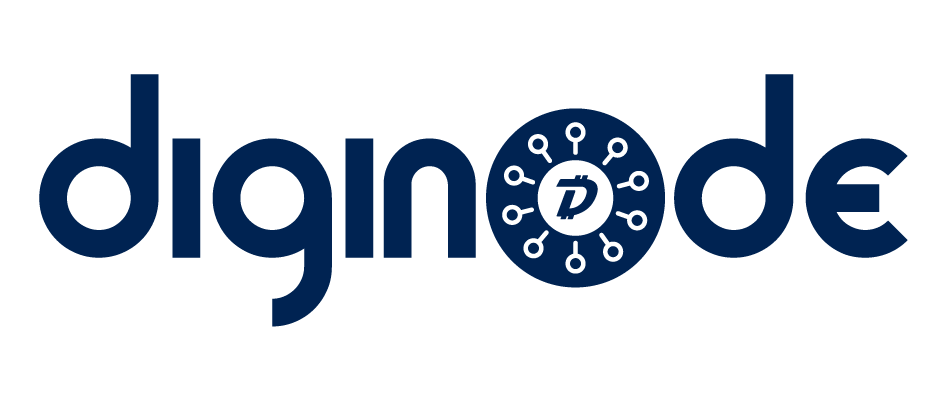
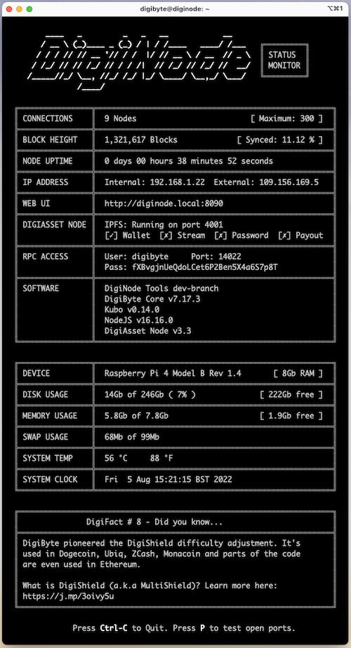

# DigiNode Tools

### What's a DigiNode?
A DigiNode is a dedicated device that runs a [DigiByte](https://digibyte.org/) Full Node and [DigiAsset Node](https://ipfs.digiassetx.com/) helping to further decentralize the DigiByte ecosystem. 

### What are DigiNode Tools?
DigiNode Tools are a suite of linux scripts that make it easy to setup, monitor and manage your DigiNode from the linux command line.

For more information, visit: https://diginode.digibyte.help (website coming soon)

### What do I need to run a DigiNode?
DigiNode Tools should run on most Debian and Ubuntu based systems. See the Compatibility section below.

If you want to build your own DigiNode, the recommended setup is a **Raspberry Pi 4 8Gb** with an SSD running **Raspberry Pi OS Lite 64-bit**. A complete list of suggested hardware is available [here](docs/suggested_hardware.md).

## DigiNode Setup

DigiNode Setup helps you to install and manage your DigiNode:

- Intuitively walks you though the process of installing a DigiByte Node and DigiAsset Node.
- Almost no linux experience required. It does all the work for you. It's as plug-and-play as possible.
- Automatically checks hardware and OS at launch - it lets you know if your system is compatible.
- Detects compatible Raspberry Pi hardware (if present).
- Creates a swap file on low memory devices, and checks if any existing swap file is large enough.
- Installs or upgrades DigiByte and DigiAssets Node software with the latest releases from GitHub.
- Creates or updates a digibyte.conf settings file with optimal settings.
- Creates digibyted.service file to keep the DigiByte Node running 24/7.
- Creates or updates an DigiAsset config file with RPC settings. 
- Optionally, creates a 'digibyte' user and sets system hostname to 'diginode'.
- Enables zeroconf networking (Bonjour) so you can access your node at http://diginode.local - i.e. no need to remember the IP address.

## DigiNode Status Monitor

DigiNode Status Monitor let's you monitor your DigiNode from the command line. It can be run by entering: `diginode`.

- Monitor your DigiNode on your local machine via the command line, locally or remotely over SSH.
- Displays live DigiByte and DigiAsset data including:
    + Connection Count
    + Block Height (with Sync Progress)
    + IP addresses (local and external)
    + Web UI address 
    + Node uptime
    + Disk, RAM and swap usage
- Periodically checks for software updates (not more than once every 24 hours) and helps you install them.



## Additional Features

Once your DigiNode has been installed, you can access additional features from the DigiNode Setup menu by entering: ```diginode-setup```

- Backup/Restore: Helps you to backup your DigiByte wallet and/or your DigiAsset Node settings to an external USB stick. 
- Reset: Resets DigiNode settings in the event of a problem.
- Uninstall: Unistalls DigiNode software from your system.

## Donations

Thousands of hours have gone into developing DigiNode Tools. If you find these tools useful, kindly make a donation in DGB to support development:

**dgb1qv8psxjeqkau5s35qwh75zy6kp95yhxxw0d3kup**


## Compatibility

- A device with at least 8Gb RAM is strongly recommended. DigiNode requires >5Gb to run. 4Gb RAM will work with a SWAP file but performance will suffer considerably. Fine for testing, not recommended for long term use. Less than 4Gb RAM is not recommended. (DigiByte Core's memory requirements exceed that of Bitcoin due to multi-algo.) 
- When using a Raspberry Pi, booting from an SSD is highly recommended. Using a microSD is inadvisable.
- DigiNode should work with most Ubuntu or Debian based systems. A 64bit OS is required.
- If you are interested in building your own DigiNode, see [here](docs/suggested_hardware.md) for a list of suggested equipment.

DigiNode has been tested and known to work with the following systems:

| **Hardware**          | **Operating System**                               | **Notes**                                                                                                   |
|-----------------------|----------------------------------------------------|-------------------------------------------------------------------------------------------------------------|
| Raspberry Pi 4 8Gb    | Raspberry Pi OS lite 64-bit (Debian Bullseye)      | This is the recommended configuration. Booting from an SSD, rather than microSD, is highly recommended.     |
| Raspberry Pi 4 8Gb    | Ubuntu Server 22.04 LTS 64-bit                     | Booting from an SSD, rather than microSD, is highly recommended. Note: Currently there are issues with the menus freezing for some unknown reason |
| Raspberry Pi 4 4Gb    | Ubuntu Server 22.04 LTS 64-bit                     | Requires swap file. Runs slowly.                                                                            |

## Disclaimer

These tools are provided as is. Use at your own risk. Make sure you always have a backup of your wallet file. 

## Setup Instructions

- To get started, run DigiNode Setup by entering the following command in the terminal:

# curl -sSL diginode-setup.digibyte.help | bash

Once DigiNode Tools has been installed, in future you can run it locally using: ```diginode-setup```

## Advanced Features

These features are for advanced users and should be used with caution:

- Unattended Mode

This is useful for installing the script completely unattended. Run this only having customized the unattended install settings in the ~/.digibyte/diginode.settings file. The settings file will be created the first time you run DigiNode Setup. To run in unattended mode, use the --unattended flag at launch.

Example: 
```curl -sSL diginode-setup.digibyte.help | bash -s -- --unattended```

- Reset Mode

This will reset and reinstall your current installation using the default settings. It will delete digibyte.conf, diginode.settings and main.json and recreate them with default settings. It will also reinstall DigiByte Core and the DigiAsset Node. IPFS will not be re-installed. Do not run this with a custom install or it may break things. For best results, run a standard upgrade first, to ensure all software is up to date, before running a reset. Software can only be re-installed if it is most recent version. You can perform a Reset via the DigiNode Setup main menu by entering ```diginode-setup```. You can also use the --reset flag at launch.

Example:
```curl -sSL diginode-setup.digibyte.help | bash -s -- --reset``` or
```diginode-setup --reset```

- Skip OS Check

The --skiposcheck flag will skip the OS check at startup in case you are having problems with your system. Proceed with caution.

Example: 
```curl -sSL diginode-setup.digibyte.help | bash -s -- --skiposcheck```

- Uninstall

The --uninstall flasg will uninstall your DigiNode. Your DigiByte wallet will be kept. This can also be accessed from the main menu.

Example: 
```curl -sSL diginode-setup.digibyte.help | bash -s -- --uninstall``` or
```diginode-setup --uninstall```

- Verbose Mode

This provides much more detailed feedback on what the scripts are doing - useful for troubleshooting and debugging. Set variable at top of either script. This can be overwridden using the --verboseon or --verboseoff flags.

Example: 
```curl -sSL diginode-setup.digibyte.help | bash -s -- --verboseon```

## Support

For help, please join the [DigiNode Tools Telegram group](https://t.me/+ked2VGZsLPAyN2Jk). You can also reach out to [@digibytehelp](https://twitter.com/digibytehelp) on Twitter.

## License

DigiNode Tools is licensed under the PolyForm Perimeter 1.0.0 license. TL;DR — You're free to use, fork, modify, and redestribute DigiNode Tools for personal and nonprofit use under the same license. If you're interested in using DigiNode Tools for commercial purposes, such as selling plug-and-play home servers with DigiNode Tools, etc — please contact olly@digibyte.help. For more information read the [Licence FAQ](docs/licence_faq.md). The full licence is [here](LICENCE.md).

## Release Notes

DigiNode Tools v0.2.4 - 2022-07-01 Test Release
- Fix: Installation now cancels if Go-IPFS fails to install. There is a recurring problem with the install files not downloading which may be a probelm with their servers. Typically, if you keep retrying it will eventually work.
- Fix: Hide swap status in status monitor if the swap is tiny (i.e. around 1 Mb)
- Fix: Correct error display if IPFS install fails

DigiNode Tools v0.2.3 - 2022-07-01 Test Release
- Fix: Start IPFS daemon during an update if it installed but not currently running (perhaps due to a failed previous install)
- Fix: If you launch Backup/Restore from the menu, and then run Update, the script now performs as expected. Before it would loop back and continue backup/restore from where you had stopped halfway though.
- Fix: Formatting of update display in status monitor

DigiNode Tools v0.2.2 - 2022-06-29 Test Release
- Fix DigiNode Tools update checker

DigiNode Tools v0.2.1 - 2022-06-29 Test Release
- Add Restore feature - you can now restore your DigiByte wallet and/or DigiAsset Settings from a previously created USB backup.
- You can now cancel inserting a USB stick by pressing a key
- Change Status Monitor timers to use unix time to fix a bug where they don't get triggered correctly
- Status monitor now displays more detail while waiting for DigiByte daemon to finish starting up
- Version number has been bumped to reflect new features added
- Note: Due to changes in how the Status Monitor tracks time, you may need to delete your existing diginode.settings file before use