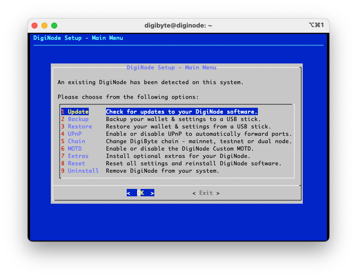

# DigiNode Tools

### What's a DigiNode?
A DigiNode is a device that runs a [DigiByte](https://digibyte.org/) Full Node and [DigiAsset Node](https://ipfs.digiassetx.com/) helping to further decentralize the DigiByte ecosystem. 

### What are DigiNode Tools?
DigiNode Tools are a suite of linux bash scripts that make it easy to setup, monitor and manage your DigiNode via the linux command line:
- **DigiNode Setup** - Helps you to install, upgrade, backup and restore your DigiByte and/or DigAsset Node.
- **DigiNode Status Monitor** - Provides a live dashboard to quickly check the status of your DigiNode.

For more information, visit: https://diginode.digibyte.help (website coming soon)

### What do I need to run a DigiNode?

DigiNode Tools should run on most Ubuntu or Debian based systems. See the Compatibility section below. 

A DigiNode is designed to operate "headless". This means you do not need a display, keyboard or mouse - everything is setup and managed remotely, using the terminal.

If you are interested in building your own DigiNode, the recommended setup is a **Raspberry Pi 4 8Gb** with an **SSD** running **Raspberry Pi OS Lite 64-bit**.  See [here](/docs/suggested_hardware.md) for the parts you need.

## Disclaimer

These tools are provided as is. Use at your own risk. Always keep a backup of your DigiByte wallet. 

## Get Started

**Detailed instructions for setting up a DigiNode on a Raspberry Pi can be found [here](docs/rpi_setup.md).**

On your Debian system, launch DigiNode Setup by entering the following command in the terminal:

## ```curl -sSL diginode-setup.digibyte.help | bash```

This will perform some system checks before displaying the setup menu that will guide you through the installation process. To customize your setup, see the "Advanced Features" section below. 

Note: DigiNode Setup also gives you the option to install DigiNode Tools only (i.e. these scripts). This is so that you can use the DigiNode Status Monitor with your existing DigiByte Node, or want to inspect the scripts before doing a full install. (They will be installed at ~/diginode-tools)

### Instructions for Ubuntu Users

Due to a bug in the latest Ubuntu release, you cannot run the install script directly from Github - when you do the menus become unresponsive. (Press Ctrl-C to exit.) The workaround is to first download DigiNode Tools to your machine, and run it locally. Until a fix is released, copy and paste the following command into the terminal, to start DigiNode Setup on Ubuntu:

```cd ~ && LATEST_RELEASE=$(curl -L -s -H 'Accept: application/json' https://github.com/saltedlolly/diginode-tools/releases/latest) && LATEST_VERSION=$(echo $LATEST_RELEASE | sed -e 's/.*"tag_name":"\([^"]*\)".*/\1/') && LATEST_VER_NUM=$(echo "$LATEST_VERSION" | sed -e "s/^v//") && RELEASE_TAR="https://github.com/saltedlolly/diginode-tools/archive/refs/tags/$LATEST_VERSION.tar.gz" && wget $RELEASE_TAR -P ~ -O - | tar -xz && mv ~/diginode-tools-$LATEST_VER_NUM ~/diginode-tools && chmod +x ~/diginode-tools/diginode-setup.sh && ~/diginode-tools/diginode-setup.sh```

## Support

If you need help, please join the [DigiNode Tools Telegram group](https://t.me/DigiNodeTools). You can also reach out to [@digibytehelp](https://twitter.com/digibytehelp) on Twitter.

## Donations

I created DigiNode Tools because I want to make it easy for everyone to run their own DigiByte and DigiAsset Node. So far, I have devoted thousands of unpaid hours working towards this goal. If you find these tools useful, please make a donation to support my work. Many thanks, Olly (Find me on Twitter @saltedlolly)

**dgb1qv8psxjeqkau5s35qwh75zy6kp95yhxxw0d3kup**


## About DigiNode Setup


DigiNode Setup helps you to setup and manage your DigiNode:

- Intuitively walks you though the process of setting up a full DigiNode, a DigiByte Node ONLY or a DigiAsset Node ONLY. 
- Almost no linux command line experience required. It does all the work for you. It's as plug-and-play as possible.
- Automatically checks hardware and OS at launch - it detects compatible Raspberry Pi hardware (if present) and lets you know if your system is compatible, and that there is enough disk space and memory to a DigiNode.
- Checks if the existing swap file is large enough, and helps create one on low memory devices.
- Installs or upgrades DigiByte and DigiAssets Node software with the latest releases from GitHub.
- Creates or updates the digibyte.conf settings file with optimal settings.
- Creates system services (systemd or upstart) to ensure the DigiByte Node and DigiAsset Node stays running 24/7.
- Creates or updates your DigiAsset Node configuration file with your RPC credentials. (This ensures you can always access your wallet from the web UI to mint DigiAssets.)
- Optionally, creates a 'digibyte' user and sets system hostname to 'diginode'. It also enables zeroconf networking (Bonjour) so you can access your node at http://diginode.local - i.e. no need to remember the IP address.
- Installs DigiNode Tools (these setup scripts) and the DigiNode Status Monitor. (see below)

To get started, see the "Get Started" section above. Once installed, DigiNode Setup can be run from the command line by entering: ```diginode-setup```

## Additional Features


Once DigiNode Tools have been installed, you can access additional features via the DigiNode Setup menu by entering: ```diginode-setup```

- **Update**: Installs any software updates for your DigiNode, and checks that all services are running correctly. It also ensures that the RPC credentials are correct and that the DigiAsset Node is able to connect with the DigiByte Node. Most DigiNode issues can be solved by performing an Update.
- **Backup**: Helps you to backup your DigiByte wallet and/or your DigiAsset Node settings to an external USB stick.
- **Restore**: Helps you to restore your DigiNode from an existing backup.
- **Ports**: Enable/disable using UPnP to forward required ports.
- **Network**: Switch between running DigiByte Core on mainnet or testnet
- **MOTD**: Enable the custom DigiNode MOTD. This displays the DigiNode logo and usage instructions whenever you login via the terminal.
- **Extras**: Install additional software such as the cooling fan software for the Argon ONE case for the Rasperry Pi.
- **Reset**: Gives you the ability to selectively reset your DigiNode settings in the event of a problem.
- **Uninstall**: Unistalls DigiNode software from your system. It lets you choose which individual components you wish to remove. Your DigByte wallet will not be harmed.

## About DigiNode Status Monitor


DigiNode Status Monitor let's you monitor your DigiNode from the command line:

- Monitor your DigiNode on your local machine via the command line, locally or remotely over SSH.
- Quickly check that your DigiByte and DigiAsset Nodes are running correctly.
- Displays live DigiByte and DigiAsset data including:
    + Connection Count
    + Block Height (with Sync Progress)
    + IP addresses (local and external)
    + Web UI address 
    + Node uptime
    + Disk, RAM and swap usage
- Periodically checks for software updates to your DigiNode (not more than once every 24 hours) and helps you install them.

DigiNode Status Monitor can be run from the command line by entering: ```diginode```

## Compatibility

- DigiNode Tools should work with most Ubuntu or Debian based systems. A 64-bit OS is required. Both ARM64 and x86_64 hardware are supported. It has been designed with headless operation in mind. 
- A DigiByte Node typically requires ~6Gb RAM but this can be higher during the intial sync. For this reason, a device with at least 8Gb RAM is strongly recommended. 4Gb RAM will work with a SWAP file but performance will be very sluggish - this is fine for testing, but definitely not recommended for long term use. Less than 4Gb RAM is definitely not recommended. (DigiByte Core's memory requirements exceed that of Bitcoin due to multi-algo.)
- A DigiAsset Node requires ~2Gb RAM. If your device has less than 4Gb RAM, you can't run a DigiByte Node, but can still support the network by running a DigiAsset Node.
- A DigiByte Node and DigiAsset Node together often exceed 8GB RAM so a SWAP file is required on any device with 8Gb RAM or less. DigiNode Setup can help configure this for you.
- As of December 2022, the DigiByte blockchain currently requires around 43Gb of disk space. If you are setting up a DigiNode, a minimum 90Gb of free disk space is recommended, to allow for future growth.
- When using a Raspberry Pi 4, booting from an SSD via USB is highly recommended. If you have an 8Gb Pi, it is possible to boot from a microSD card, though this is not recommended for long term use.
- If you are interested in building your own DigiNode using a Raspberry Pi 4, you can find a list of the parts you need [here](docs/suggested_hardware.md).

DigiNode has been tested and known to work with the following systems:

| **Hardware**          | **Operating System**                               | **Notes**                                                                                                   |
|-----------------------|----------------------------------------------------|-------------------------------------------------------------------------------------------------------------|
| Raspberry Pi 4 8Gb    | Raspberry Pi OS lite 64-bit (Debian Bullseye)      | This is the recommended configuration. Booting from an SSD, rather than microSD, is highly recommended.     |
| Raspberry Pi 4 8Gb    | Ubuntu Server 22.04 LTS 64-bit                     | Booting from an SSD, rather than microSD, is highly recommended.  Note: There is currently a known issue with this release of Ubuntu that causes the menus to become unresponsive when piping though bash. If you experience this, you may want to try using Raspberry Pi OS instead, or alternatively first clone the DigiNode Tools repo to your home folder, before running the diginode-setup.sh script locally. |
| Raspberry Pi 4 4Gb    | Raspberry Pi OS lite 64-bit (Debian Bullseye)      | Requires swap file. Runs slowly. Fine for testing - not recommended for long-term use.                                                                            |
| x86_64 (Intel/AMD)    | Ubuntu Server 22.04 LTS 64-bit                     | Tested and working on an Intel Core i3-380M laptop with 8Gb RAM.                                            |

## License

DigiNode Tools is licensed under the PolyForm Perimeter 1.0.0 license. TL;DR — You're free to use, fork, modify, and redestribute DigiNode Tools for personal and nonprofit use under the same license. However, you may not re-release DigiNode Tools in an official capacity (i.e. on a custom website or custom URL) in a form which competes with the original DigiNode Tools. This is to ensure that there remains only one official release version of DigiNode Tools. If you're interested in using DigiNode Tools for commercial purposes, such as selling plug-and-play home servers with DigiNode Tools, etc — please contact olly@digibyte.help. For more information read the [Licence FAQ](docs/licence_faq.md). The full licence is [here](LICENCE.md).

## Advanced Features

These features are for advanced users and should be used with caution:

**Unattended Mode:** This is useful for installing the script completely unattended. To run in unattended mode, use the --unattended flag at launch. 
- ```curl -sSL diginode-setup.digibyte.help | bash -s -- --unattended``` or
- ```diginode-setup --unattended```

Note: The first time you run DigiNode Setup in Unattended mode, it will create the required diginode.settings file and then exit. If you wish to customize your installation further, you can edit this file before proceeding. It is located here: ~/.digibyte/diginode.settings
If you want to skip this step, and simply use the default settings, include the --skipcustommsg flag:
- ```curl -sSL diginode-setup.digibyte.help | bash -s -- --unattended --skipcustommsg``` or
- ```diginode-setup --unattended --skipcustommsg```

**DigiAsset Node ONLY Setup:** If you have a low spec device that isn't powerful enough to run DigiByte Node, you can use the ```--dganodeonly``` flag to setup only a DigiAsset Node. Using this flag bypasses the hardware checks required for the DigiByte Node. A DigiAsset Node requires very little disk space or memory and should work on very low power devices. If you later decide you want to install a DigiByte Node as well, you can use the ```--fulldiginode``` flag to upgrade your existing DigiAsset Node setup. This can also be accessed from the main menu.
- ```curl -sSL diginode-setup.digibyte.help | bash -s -- --dganodeonly``` or
- ```diginode-setup --dganodeoonly```

**Reset Mode**: This will reset and reinstall your current installation using the default settings. It will delete digibyte.conf, diginode.settings and main.json and recreate them with default settings. It will also reinstall DigiByte Core and the DigiAsset Node. IPFS will not be re-installed. Do not run this with a custom install or it may break things. For best results, run a standard upgrade first, to ensure all software is up to date, before running a reset. Software can only be re-installed if it is most recent version. You can perform a Reset via the DigiNode Setup main menu by entering ```diginode-setup```. You can also use the --reset flag at launch.
- ```curl -sSL diginode-setup.digibyte.help | bash -s -- --reset``` or
- ```diginode-setup --reset```

**Skip OS Check:** The --skiposcheck flag will skip the OS check at startup in case you are having problems with your system. Proceed with caution.
- ```curl -sSL diginode-setup.digibyte.help | bash -s -- --skiposcheck``` or
- ```diginode-setup --skiposcheck```

**Skip Update Package Cache:** The --skipupdatepkgcache flag will skip trying to update the package cache at launch in case you are do not have permission to do this. (Some VPS won't let you update.)
- ```curl -sSL diginode-setup.digibyte.help | bash -s -- --skipupdatepkgcache``` or
- ```diginode-setup --skipupdatepkgcache```

**Uninstall:** The --uninstall flag will uninstall your DigiNode. Your DigiByte wallet will be kept. This can also be accessed from the main menu.
- ```curl -sSL diginode-setup.digibyte.help | bash -s -- --uninstall``` or
- ```diginode-setup --uninstall```

**Verbose Mode:** This provides much more detailed feedback on what the scripts are doing - useful for troubleshooting and debugging. This can be set using the ```--verboseon``` flags.
- ```curl -sSL diginode-setup.digibyte.help | bash -s -- --verboseon```
- ```diginode-setup --uninstall```

**Manually Locate DigiByte Core:** If you wish to use the DigiNode Status Monitor with your existing DigiByte Node (i.e. One not setup with DigiNode Tools), and the startup checks are not able to locate it automatically, use the ```--locatedgb``` flag at launch to manually specify the folder location.
- ```diginode --locatedgb```

**Developer Mode:** To install the development branch of DigiNode Tools, use the ```--dgntdev``` flag at launch. The ```--dgadev``` flag can be used to install the development branch of the DigiAsset Node. WARNING: These should only be used for testing, and occasionally may not run.
- ```curl -sSL diginode-setup.digibyte.help | bash -s -- --dgntdev --dgadev``` or
- ```diginode-setup --dgntdev --dgadev```

## Release Notes

Go [here](/docs/release_notes.md) to view the release notes.